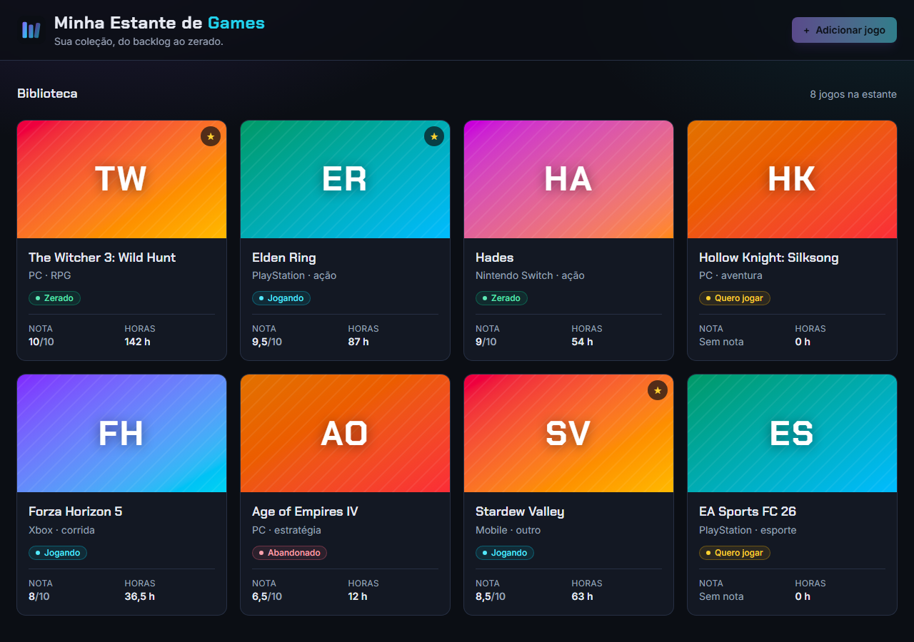
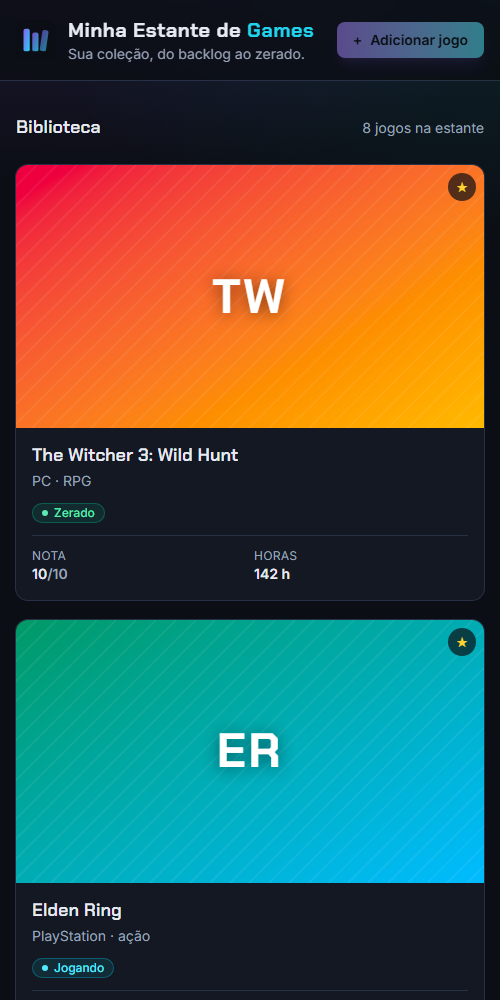

# Minha Estante de Games

Quem joga bastante sabe como é: um jogo pela metade, outro que você jura que vai começar e aquele que ficou esquecido. Criei este app para organizar minha coleção: o que estou jogando, o que já zerei, o que quero jogar e o que abandonei.

É também o projeto em que estou aprendendo **React**, construído em etapas.



## Funcionalidades

O que já funciona (Etapa 1):

- Listagem dos jogos em cards, com capa gerada, título, plataforma, gênero, status, nota, horas jogadas e estrela de favorito
- Capa própria para cada jogo, feita com um gradiente e as iniciais do título, sem usar artes oficiais. O mesmo título sempre gera a mesma capa
- Cor diferente para cada status: jogando, zerado, quero jogar e abandonado
- Números no padrão brasileiro (9,5/10 e 36,5 h), e "Sem nota" quando o jogo ainda não tem avaliação
- Tema escuro com cara de launcher de games
- Layout responsivo: 1 coluna no celular, 2 no tablet e até 4 no desktop

Por enquanto a lista usa dados de exemplo fixos. Cadastro, edição e exclusão chegam na próxima etapa.

## No celular



## Tecnologias

- React 19
- TypeScript no modo strict
- Tailwind CSS v4
- Vite
- Oxlint para análise do código

Sem bibliotecas de componentes prontas: todos os componentes são feitos por mim.

## Estrutura de pastas

```
src/
├─ components/     componentes da tela (GameCard, GameList, Header...)
│  └─ ui/          componentes genéricos e reutilizáveis (Button)
├─ constants/      listas de opções, rótulos e cores de cada status
├─ data/           jogos de exemplo
├─ hooks/          custom hooks (próxima etapa)
├─ services/       acesso aos dados (próxima etapa)
├─ types/          tipos TypeScript do projeto
└─ utils/          funções puras, como a que gera a capa
```

## Algumas decisões do projeto

- **Union types em vez de texto solto.** O status é `'jogando' | 'zerado' | 'quero jogar' | 'abandonado'`, e não uma `string` qualquer. Assim o editor autocompleta os valores, e um erro de digitação como `'zerdo'` vira erro de compilação em vez de bug escondido. O mesmo vale para plataforma e gênero.
- **`Record` para não esquecer nenhum caso.** As cores e os rótulos dos status ficam num `Record<GameStatus, string>`. Se um status novo for criado, o TypeScript avisa que falta a cor dele.
- **Componentes pequenos.** Cada parte da tela é um componente com uma responsabilidade: `GameCover` desenha a capa, `StatusBadge` mostra o status e `GameCard` junta tudo. Isso facilita reaproveitar e entender o código.
- **Props tipadas.** Cada componente declara o que recebe com uma `interface`. Se eu esquecer de passar um dado ou passar o tipo errado, o erro aparece no editor.
- **Lógica fora dos componentes.** As funções que geram as iniciais e o gradiente da capa ficam em `utils/`, como funções puras (mesma entrada, mesma saída). Isso vai facilitar os testes automatizados.
- **Pensando no back-end desde já.** As datas ficam em formato ISO e existe uma pasta `services/` reservada para o acesso aos dados. A ideia é começar com localStorage e, no futuro, trocar por uma API REST com banco de dados mexendo só nessa camada.
- **Acessibilidade.** O idioma da página é `pt-BR`, os cards usam HTML semântico (`article`, `dl`), a estrela de favorito tem texto para leitores de tela e o foco do teclado fica bem visível.

## Como rodar

Você precisa ter o [Node.js](https://nodejs.org/) instalado. Clone o repositório:

```bash
git clone https://github.com/GabrielMassimini/estante-de-games.git
cd estante-de-games
```

Instale as dependências e rode o projeto:

```bash
npm install
npm run dev
```

Depois abra `http://localhost:5173` no navegador.

Outros comandos:

```bash
npm run build   # verifica os tipos e gera a versão de produção
npm run lint    # analisa o código
```

## O que aprendi

- Criar um projeto React com Vite e TypeScript, e configurar o Tailwind CSS
- O que são componentes, JSX e props, e como montar uma tela juntando componentes pequenos
- Tipar as props dos componentes com `interface`
- Renderizar listas com `map` e entender para que serve a `key`
- Mostrar elementos só quando faz sentido (a estrela de favorito, o "Sem nota")
- Usar union types e `Record` para o TypeScript me ajudar a evitar erros
- Criar um tema com variáveis no Tailwind e um layout responsivo com Grid
- Organizar as pastas de um projeto pensando em como ele vai crescer

## Próximos passos

O projeto está sendo construído em etapas:

- [x] **Etapa 1:** estrutura do projeto, tipos, layout e listagem em cards
- [ ] **Etapa 2:** cadastrar, editar e excluir jogos, trocar status no card e salvar no localStorage
- [ ] **Etapa 3:** busca, filtros, ordenação e painel de estatísticas
- [ ] **Etapa 4:** exportar e importar a estante em JSON, testes com Vitest e publicação na Vercel

## Contato

Gabriel Massimini · [GitHub](https://github.com/GabrielMassimini) · [LinkedIn](https://www.linkedin.com/in/gabriel-massimini-junqueira/)
